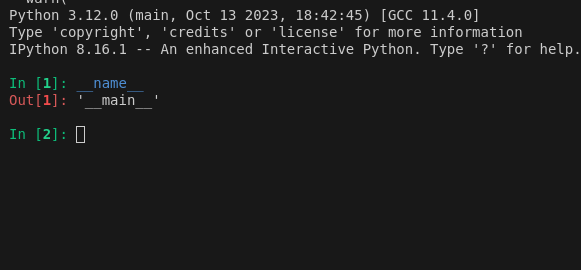
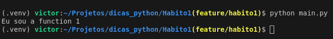
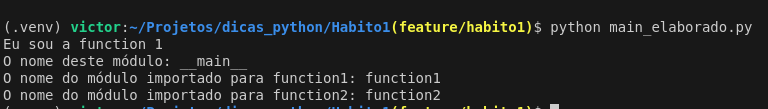

# Primeiro Bom Hábito

## O uso do famigerado __name__ (dunder name, para os mais íntimos)

- O dunder name em si, não faz nada, somente retorna, ao ser chamado, esta variável especial retornará o nome do módulo em que ela está sendo chamada. 

- Se você executá-lo diretamente de um interpretador python, ele retornará: "__main__", como vemos na imagem abaixo: 

- 

- Isto ocorre pois ele está sendo chamado a partir do módulo principal onde o python está sendo executado. 

- Mas se você executar o script main.py, presente na raíz de Habito1/ você verá o seguinte(dado que as funções function1 e function2 apenas imprimem):

- 

## Mas, por que isto ocorre?
- Quando executamos main, será importado de function, as funções function1 e function2, e para isto, o python lê todo o código do arquivo, de cima para baixo e da esquerda para a direita, a fim de carregar a function1. 
Neste momento, ele lerá todo o módulo, e ao chegar na linha 7, a qual representa a chamada da função, ela será retornada. Então, mesmo que você não importe a function1, mas importe a function2, no momento da importação, a function1 será executada ao chegar na linha 7, pois o python lerá o arquivo inteiro mesmo que só vá usar a function1.

- O mesmo não ocorre com a chamada da function2, que acontece na linha 11. Pois aqui ela está contida em uma condição que implica que o módulo ao qual ela está sendo chamada, seja o principal. Por este motivo, o uso do famigerado __ name __ nesta condição nos evita de executar a função no momento em que ela é importada. 

- A imagem abaixo representa a execução do arquivo main_elaborado.py, o qual busca pelo atributo especial __ name __, das funções onde elas sendo chamadas:

- 
