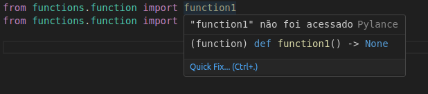
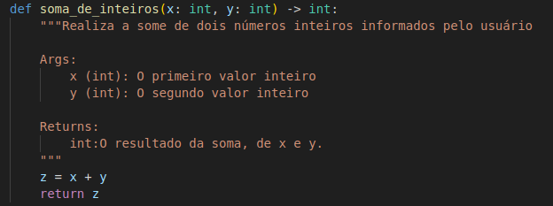
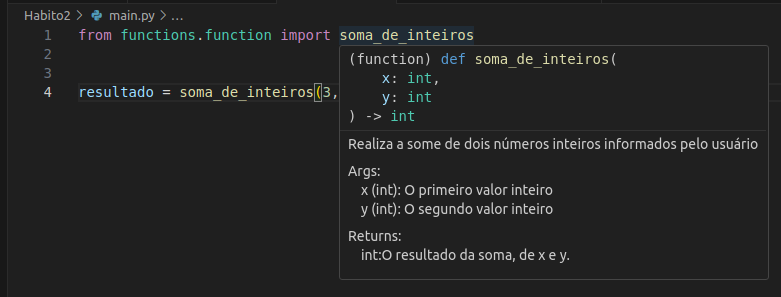

# Segundo Bom Hábito

## O uso de Docstring e TypeHint

- Nas funções definidas no Habito1/, não passamos informação alguma de tipagem ou mesmo algum descritivo sobre o que a função faz. Então, não temos informação alguma, se por exemplo utilizamos a ide a finalidade de buscar informações sobre a função, no momento da importação:

- 

- Então vamos adicionar typehint(informando o tipo de cada argumento, e o tipo que a função retorna) e docstring(descrevendo um pouco sobre o que a função faz, o que é cada um dos argumentos e o que a função retorna) a nossa função:

- 

- Recomendo utilizar alguma extensão do ide para a criação de docstring, no caso foi utilizada a autoDocstring, para vscode. 

## Mas qual a grande vantagem disso?

- Agora, podemos ver estas informações da função com nosso ide. Da mesma forma, ele será capaz de informar o tipo que cada variável possui, ao passar o mouse por cima:

- 

- Isto é muito conveniente, uma vez que raramente seremos o único a utilizar nosso código.
