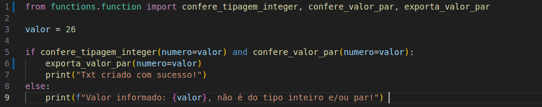

# Terceiro Bom Hábito

## Funções que desempenham apenas uma função!

- Parece muito redundante, e com certeza pouco intuitivo, e ao mesmo tempo um pleonasmo. Mas é muito comum, ao escrevermos uma função, irmos aumentando o número de coisas que ela faz, e aumentando assim sua complexidade.

- Por exemplo, na função a seguir, quantas responsabilidades está função possui?

- 

- __Vamos analisar:__
    - Linha 11 e Linha 14: Verificam a tipagem da variável número;
    - Linha 17: Verifica se o número informado é par;
    - Linha 18 a 20: Exporta um arquivo txt.

Claro, esta função é pequena, e é apenas um exemplo. Mas de qualquer forma, podemos torná-la melhor, aplicando a ideia de que uma função deve fazer apenas um coisa, e deve fazê-la muito bem (__Uncle Bob__ em __Código Limpo__, recomendo __^^__). 

## Como podemos melhorar? 

- vamos reconstruí-la, e desta vez não teremos uma, mas sim 3 funções:
    - Uma que confere a tipagem da variável numero;
    - Outra que verifica se o valor é um número par;
    - E por fim, a função que exporta o arquivo txt.

- 

- E vamos aplicar aqui, também uma outra abordagem, que é a de chamar a função em um lugar diferente de onde ela é criada. Vamos executar estas funções no main.py:

- 

Como a função inicial executa um processo simples, não há grandes problemas em juntar tudo no mesmo escopo. Mas conforme a função vai crescendo, vai se tornando muito difícil de dar manutenção. 
Então, sempre lembrar:

- __Uma função deve fazer apenas um coisa, e deve fazê-la muito bem!__