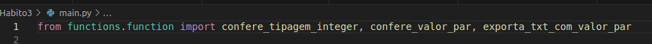
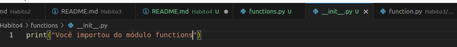
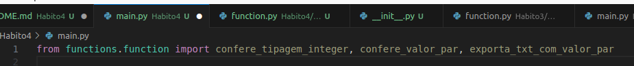
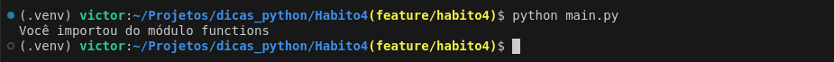
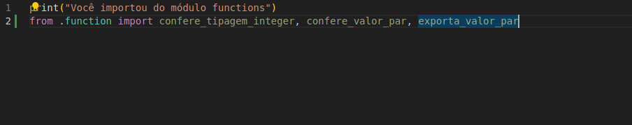

# Quarto Bom Hábito

## Melhorando os imports com o famigerado init

- Se olharmos para como estamos importando a função, nos diretórios responsáveis pelos hábitos anteriores, podemos ver que é uma chamada um pouco extensa:

- 

- Como estamos executando dentro de Habito3/, então devemos percorrer o diretório functions, o arquivo functions, para só então chamarmos as funções, que ainda bem que não estão compreendidas em classes, senão o import ficaria ainda maior. 

- Mas podemos melhorar este import, utilizando o arquivo dunder init .py, ou o `__init__.py`. 
- Até a versão 3.3 (senão me engano, é esta versão), o python o obrigava a criar um arquivo `__init__.py` para que então este pudesse ser um módulo, consecutivamente uma biblioteca. Mesmo que fazio, este arquivo era necessário, do contrário era impossível realizar importação. 
- Aqui veremos como usá-lo para otimizar nossa importação. Mas primeiro vamos fazer um teste:
    - Dentro de functions, ao lado de functions.py, vamos criar o arquivo `__init__.py`:
    - E vamos editar o arquivo init, e deixá-lo como segue a imagem:
    - 
    - E agora, vamos executar nosso arquivo main.py, que neste momento contem isto:
    - 
    - E ao executar o main.py, isto acontece:
    - 

## Vamo entender o que houve

- Sempre que você importa um módulo/biblioteca, o arquivo `__init__.py`, como o nome sugere, é por onde a execução se inicia, então este arquivo é executado primeiro. Logo, o `__init__.py` será usado para tratar as importações para nós.

- Então, agora vamos usá-lo para melhorar nosso import:
    - Dentro de functions, no arquivo `__init__.py`, deixe-o desta forma:
    - 
    - E finalmente, em main, vamos chamar estas funções com importações melhoradas:
    - 
