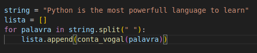
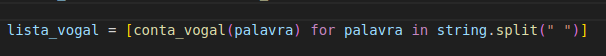
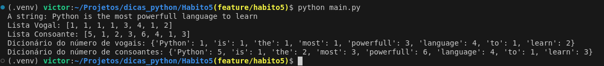

# Quinto Bom Hábito

## O Uso de list comprehension e dict comprehension

## List Comprehension

- O uso de laços faz parte da rotina de qualquer desenvolvedor. No python, há estas técnicas que nos permitem, por exemplo, realizar o preenchimento de uma lista, ou de um dicionário com apenas uma linha
- Em functions, temos dois módulos, um que possui uma função que conta o número de consoantes que há em dada string, e outra que conta o número de vogais. 
- Este é um tipo de função que faz sentido imaginarmos que iremos aplicar a fim de ao final preenchermos uma lista. Então está lista seria preenchida como a seguir:
- 
- Neste exemplo, não há validações nem condições neste loop. Mas mesmo assim, é necessário de uma linha a mais para se criar a lista, definindo assim uma lista vazia antes do início do loop. 
- Utilizando list comprehension, podemos simplificar como a seguir:
- 
- Ainda poderíamos ir além, se quiséssemos aplicar a função somente a palavras específicas, como ficaria?

## Dict Comprehension

- Assim como na elaboração de listas, para preenchimento de dicionários, devemos realizar iterações, e vários passos. 

- Então, como ficaria a execução destas mesmas funções, de modo que eu consiga trazer para cada palavra, o número de consoantes que ela possui? E para vogais? 
- Dict comprehension e list comprehension nos permite executar isto em apenas uma linha, e o resultado é a seguir:
- 

- Vale a pena o estudo destas técnicas!

- Muito obrigado pela leitura, até a próxima!